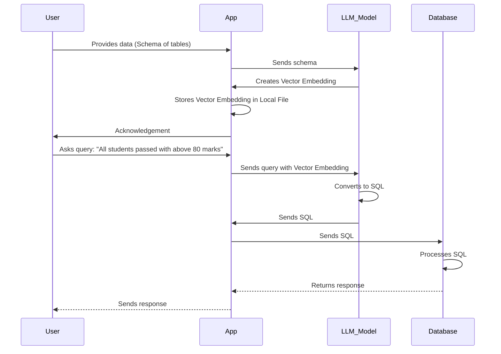

<div align="center">
<a href="https://refine.dev/">
    
</a>
</div>
<!-- <div style="font-family: 'Lucida Console', 'Courier New', monospace; font-size: 25px;  font-family: Arial, Helvetica, sans-serif;
			background: linear-gradient(to right, #f32170,
					#ff6b08, #cf23cf, #eedd44);
			-webkit-text-fill-color: transparent;
			-webkit-background-clip: text;;">DbSenseAi</div> -->

<!-- <br/> -->
<!-- <div align="center">
    <a href="" style="color: ;">Home Page</a> |
    <a href="">Discord</a> |
    <a href="">Blog</a> |
    <a href="">Documentation</a>
</div> -->
<!-- <br/>
<br/> -->
<!-- <div align="center"><strong>Add Here <a href="">Something</a> Add here.</strong><br>add here</div> -->

<br />
<br />
<div>
<div align="center">

[](https://github.com/refinedev/awesome-refine)
[](https://www.bestpractices.dev/projects/8101)
[](https://www.npmjs.com/package/@refinedev/core)
[](https://github.com/refinedev/refine/commits/master)
[](CODE_OF_CONDUCT.md)
<br/>
<br/>

</div>

</div align="left" >

## What is DbSenseAi

**DbSenseAI** is a fast and lightweight library that simplifies chatting with your database. Unlike traditional methods, it doesn't need to embed all your database data. Instead, it focuses only on the schema, making it efficient and quick.
</br>

**Features**:

- _**Efficient Schema Embedding**: Only embeds schema, skipping the need to embed all database data._

- _**Fast Database Interaction**: Enables quick communication with your database._

- _**Resource Optimization**: Saves resources by avoiding unnecessary data embedding._

- _**Versatile Integration**: Works well with various database systems._
  </br>

## How DbSenseAi works ?




The sequence diagram illustrates the process flow of a system where a user provides data to DBSenseAi, which includes schema information of tables. DBSenseAi forwards this schema to the Language Model (LLM_Model), which generates Vector Embeddings. These embeddings are stored locally by DBSenseAi. When the user queries for students who passed with above 80 marks, DBSenseAi sends this query along with the embeddings to the LLM_Model, which converts it into SQL. The SQL is then forwarded to the Database, processed, and the response is sent back to DBSenseAi, which in turn delivers it to the user.


## ⚡ Try DbSenseAi

### Prerequisites

- #### **make**

  <details open>
    <summary>Install make on Linux</summary>

  ```bash
  $ sudo apt install make
  ```

  Check version

  ```bash
  $ make -version
  ```

  </details>

- #### **G++**

  <details open>
    <summary>Install G++ on Linux</summary>

  ```bash
  $ sudo apt install g++
  ```

  Check version

  ```bash
  $ g++ --version
  ```

  </details>

## Installation

```bash
$ npm i dbsense-ai
```

## Setting-up `.env`

Your `.env` file should include

```
export OPENAI_API_KEY=<YOUR_OPENAI_KEY>
DB_DATABASE=<YOUR_DATABASE_NAME>
DB_HOST=<YOUR_DATABASE_HOST>
DB_PORT=<YOUR_DATABASE_PORT>
DB_USER=<YOUR_DATABASE_USER>
DB_PASSWORD=<YOUR_DATABASE_PASSWORD>
```

Once the package is installed, you can import the library using import or require approach:

```javascript
var DbSenseAi = require("dbsense-ai");
```

Instanciate the DbSenseAi class

```javascript
const dbsenseai = new DbSenseAi();
```

## Usage

_Add your create table query inside the createTable() function_

```javascript
await dbsenseai.createTable(
  "CREATE TABLE cosmetics (brand VARCHAR(100) NOT NULL,product_type VARCHAR(100) NOT NULL,product_price NUMERIC(10, 2));"
);
```

_Add your prompt inside the ask() function_

```javascript
let response = await dbsenseai.ask(
  "Give me name of all brands sorted in ascending order of price"
);
```

_You can get the response as table and summary_

```javascript
console.table(response.table);
console.log(response.summary);
```

</br>

# Contributing to Library

### Prerequisites

If you don't have git on your machine, [install it](https://docs.github.com/en/get-started/quickstart/set-up-git).

- #### **make**

  <details open>
    <summary>Install make on Linux</summary>

  ```bash
  $ sudo apt install make
  ```

  Check version

  ```bash
  $ make -version
  ```

  </details>

- #### **G++**

    <details open>
      <summary>Install G++ on Linux</summary>
      
    ```bash
    $ sudo apt install g++
    ```

  Check version

  ```bash
  $ g++ --version
  ```

    </details>

## Fork this repository


Fork this repository by clicking on the fork button on the top of this page. This will create a copy of this repository in your account.
</br>

## Clone the repository


Now clone the forked repository to your machine. Go to your GitHub account, open the forked repository, click on the code button and then click the _copy to clipboard_ icon, this is the COPIED_URL.

Open a terminal and run the following git command:

```git
git clone "COPIED_URL"
```

e.g : `git clone https://github.com/vedanti-u/db.ai.git`
</br>

---

### Install dependencies

```bash
npm install
```

---

### Create a branch

Change to the repository directory on your computer (if you are not already there):

```bash
$ cd dbsense-ai
```

Now create a branch using the `git checkout` command:

```bash
$ git checkout -b new-branch-name
```

e.g : `git checkout -b llm-prompt-support`

**Name your branch according to the feature you are working on :**

e.g : you want to work on creating more llm prompt support, name your branch like `llm-prompt-support`

_(follow this naming convention i.e using "-" in between)_

### _Make necessary changes_

#### Create a `.env` File with format

```
export OPENAI_API_KEY=<YOUR_OPENAI_KEY>
DB_DATABASE=<YOUR_DATABASE_NAME>
DB_HOST=<YOUR_DATABASE_HOST>
DB_PORT=<YOUR_DATABASE_PORT>
DB_USER=<YOUR_DATABASE_USER>
DB_PASSWORD=<YOUR_DATABASE_PASSWORD>
```

### Linking the library locally

```bash
rm -rf dist
tsc
npm link
npm link dbsense-ai
```

## Testing the library locally

```bash
node test/localLibrary.test.ts --env=.env
```

### Create a pull request

  <details>
   <summary>How to create pull request</summary>
  </br>
  Once you have modified an existing file or added a new file to the project of your choice, you can stage it to your local repository, which we can do with the `git add` command. In our example, `filename.md`, we will type the following command.

<code>$ git add filename.md</code>

where filename is the file you have modified or created

If you are looking to add all the files you have modified in a particular directory, you can stage them all with the following command:
`git add .`

Or, alternatively, you can type `git add -all` for all new files to be staged.

<h3>Commiting the changes</h3>
<code>git commit -m "Added a new prompt in prompts.json file"</code>

<h3>To PUSH your branch to your remote main</h3>
<code>$ git push --set-upstream origin your-branch-name</code>
</br>

e.g : `$ git push --set-upstream origin optimise-binding`

<h4>Open Github</h4>

click on compare & pull request
</br>

write a description for your pull request specifing the changes you have made, title it and then, Click on create pull request

_your branch will be merged on code review_

  </details>
